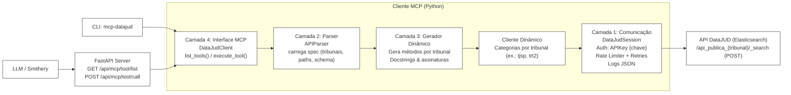

# MCP DataJUD (Python)

Cliente MCP dinâmico para a API Pública do DataJUD (CNJ).

## Instalação

```bash
python -m venv .venv && source .venv/bin/activate
pip install -e .
```

## Configuração

Defina a variável `DATAJUD_API_KEY` com sua chave pública.

## CLI

- Listar ferramentas:

```bash
mcp-datajud list-tools
```

- Executar uma ferramenta (params como JSON):

```bash
mcp-datajud execute tjsp.buscar_processos --params '{"query": {"match_all": {}}, "size": 5}'
```

## Server (opcional)

```bash
uvicorn mcp_datajud.server:app --host 0.0.0.0 --port 8000
```

## Código

Arquitetura em camadas: comunicação HTTP, parser, gerador dinâmico, interface MCP.

## Arquitetura



## Como usar o MCP com Cursor, VSCode, Claude, Gemini-CLI e n8n

- Pré-requisitos
  - Servidor rodando: `uvicorn mcp_datajud.server:app --host 0.0.0.0 --port 8000`
  - Endpoints MCP (HTTP):
    - `GET /api/mcp/tool/list` → `{ tools: [...] }`
    - `POST /api/mcp/tool/call` → `{ result: ... }`

- Smithery CLI (ponte HTTP → STDIO MCP)
  - Execute como servidor MCP local (stdio):

    ```bash
    npx -y @smithery/cli mcp http --url http://127.0.0.1:8000
    ```

  - Opções úteis:
    - `--list-endpoint /api/mcp/tool/list`
    - `--call-endpoint /api/mcp/tool/call`

- Cursor
  - Tools → Add MCP Server → Nome: `mcp-datajud`
  - Comando:

    ```bash
    npx -y @smithery/cli mcp http --url http://127.0.0.1:8000
    ```

  - O Cursor detectará e listará as ferramentas (ex.: `tjsp.buscar_processos`).

- VSCode (Extensão Claude)
  - Em `settings.json`:

    ```json
    {
      "claude.mcpServers": {
        "mcp-datajud": {
          "command": "npx",
          "args": ["-y", "@smithery/cli", "mcp", "http", "--url", "http://127.0.0.1:8000"]
        }
      }
    }
    ```

- Claude Desktop (config MCP)
  - Arquivo: `~/Library/Application Support/Claude/claude_desktop_config.json` (macOS)
  - Adicione:

    ```json
    {
      "mcpServers": {
        "mcp-datajud": {
          "command": "npx",
          "args": ["-y", "@smithery/cli", "mcp", "http", "--url", "http://127.0.0.1:8000"]
        }
      }
    }
    ```

- Gemini-CLI
  - Use diretamente os endpoints HTTP em shell scripts:

    ```bash
    curl -s http://127.0.0.1:8000/api/mcp/tool/list | jq
    curl -s -X POST http://127.0.0.1:8000/api/mcp/tool/call \
      -H 'Content-Type: application/json' \
      -d '{"toolName":"tjsp.buscar_processos","toolArgs":{"query":{"match_all":{}},"size":1}}' | jq
    ```

  - Alternativa: usar a ponte Smithery (comando acima) e integrar em workflows que aceitam processos MCP via STDIO.

- n8n
  - Node 1: HTTP Request (GET)
    - URL: `http://127.0.0.1:8000/api/mcp/tool/list`
    - Response: JSON → `{{$json["tools"]}}`
  - Node 2: HTTP Request (POST)
    - URL: `http://127.0.0.1:8000/api/mcp/tool/call`
    - Body (JSON):

      ```json
      {
        "toolName": "tjsp.buscar_processos",
        "toolArgs": {"query": {"match_all": {}}, "size": 1}
      }
      ```

  - Encadeie os nós para escolher a ferramenta e executar com parâmetros dinâmicos.
